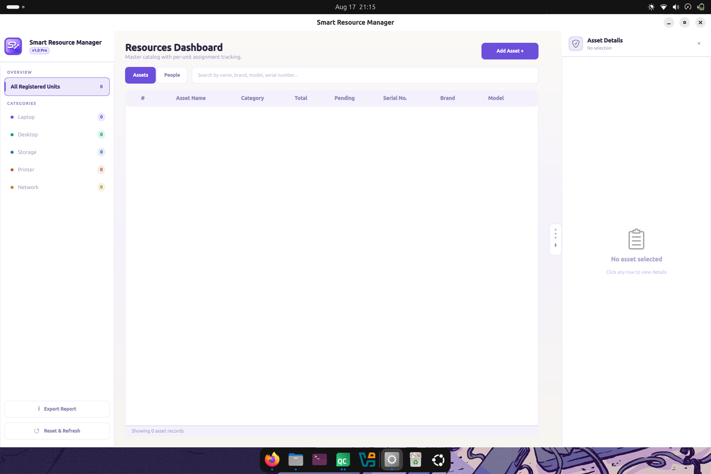
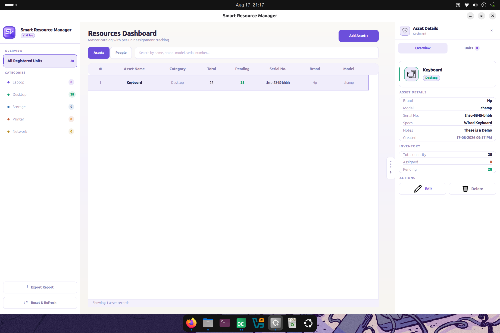
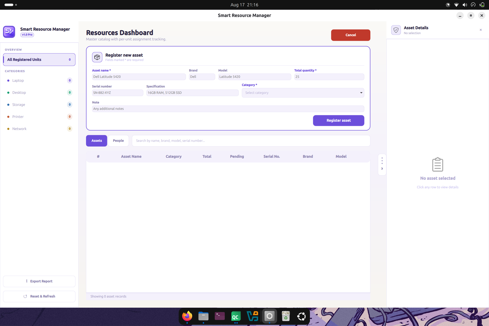
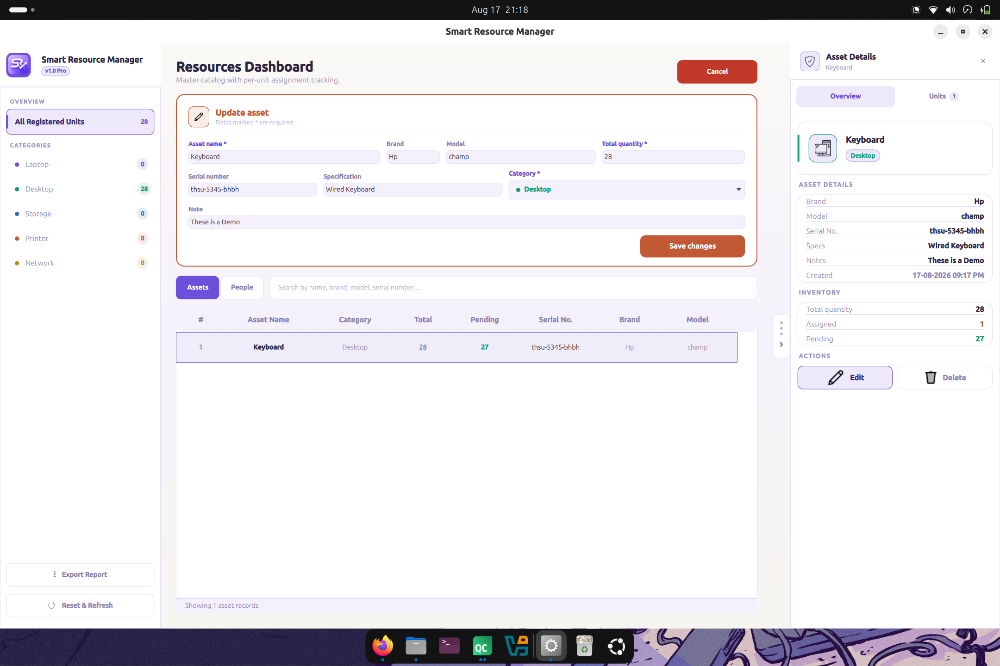
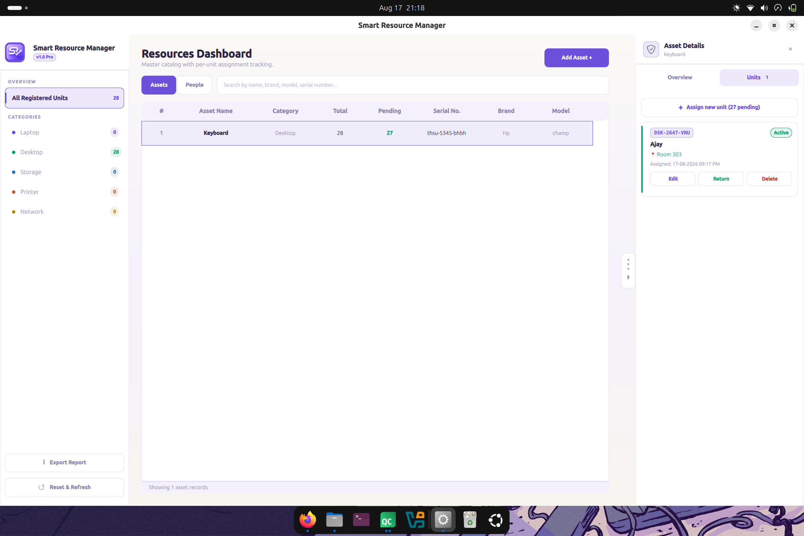
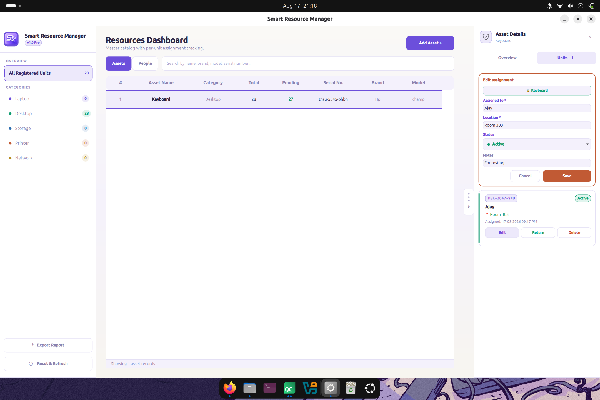

# Smart Resource Manager

A desktop-based **Smart Resource Manager** for managing IT hardware and organizational assets, built using **C++17, Qt 6, QML, CMake, and SQLite**.

Smart Resource Manager provides a modern desktop interface for maintaining inventory records, managing assigned assets, categorizing resources, searching and filtering inventory, and exporting inventory information to CSV.

---

## Application Screenshots

### Main Dashboard



The main dashboard provides an overview of the Smart Resource Manager and access to the major asset-management functions.

---

### Inventory Management



The inventory view displays stored resource records and provides functionality for managing existing assets.

---

### Add Asset



Users can add new IT resources to the inventory by entering the required asset information.

---

### Update Asset



Existing asset records can be updated when hardware information changes.

---

### Assigned Assets



The Assigned Assets section allows resources to be associated with individual asset IDs and tracked separately.

---

### Update Assigned Asset



Assigned asset information can be modified when required.

---

## Features

* Hardware and IT resource management
* Add new inventory assets
* Update existing assets
* Delete inventory records
* Resource categorization
* Inventory search and filtering
* Assigned asset management
* Individual IDs for assigned assets
* Export inventory records to CSV
* SQLite-based local database
* Modern QML-based user interface
* C++ application backend
* Qt 6 integration
* CMake build system
* Resource icons for different hardware categories
* Local and offline operation

---

## Supported Resource Categories

Smart Resource Manager is designed to manage different types of IT resources, including:

*  Laptop
*  Desktop
*  Printer
*  Network Equipment
*  Storage
*  Other IT Resources

---

## Technologies Used

| Technology         | Purpose                        |
| ------------------ | ------------------------------ |
| **C++17**          | Application and business logic |
| **Qt 6**           | Application framework          |
| **Qt Quick / QML** | Graphical user interface       |
| **Qt SQL**         | Database integration           |
| **SQLite**         | Local data storage             |
| **CMake**          | Build system                   |
| **Git**            | Version control                |
| **GitHub**         | Source code hosting            |
| **OpenGL / EGL**   | Graphics rendering             |

---

## Application Architecture

The project separates the user interface, application logic, database layer, and resources.

```text
Smart Resource Manager
│
├── QML UI
│   └── User Interface
│
├── C++ Backend
│   ├── Inventory Manager
│   └── Database Manager
│
├── Qt SQL
│   └── SQLite Integration
│
├── SQLite
│   └── Local Inventory Data
│
└── Resources
    ├── Icons
    └── QML Resources
```

### Main Components

#### QML UI

Responsible for the graphical user interface, layouts, controls, navigation, and user interaction.

#### Inventory Manager

Handles inventory-related application logic such as adding, updating, deleting, searching, and managing resource records.

#### Database Manager

Provides the database layer and handles SQLite database operations and local data persistence.

#### Qt SQL / SQLite

Provides local database storage without requiring an external database server.

#### Resources

Contains application icons and QML resources used by the interface.

---

## Project Structure

```text
Smart_Resources_Manager/
│
├── CMakeLists.txt
├── README.md
├── .gitignore
├── main.cpp
│
├── database_manager.cpp
├── database_manager.h
│
├── inventory_manager.cpp
├── inventory_manager.h
│
├── resources.qrc
│
├── icons/
│   ├── clipboard.png
│   ├── delete.png
│   ├── desktop.png
│   ├── edit.png
│   ├── laptop.png
│   ├── logo.png
│   ├── network.png
│   ├── package.png
│   ├── printer.png
│   ├── shield.png
│   └── storage.png
│
├── qml/
│   └── main.qml
│
└── screenshots/
    ├── main-dashboard.png
    ├── inventory.png
    ├── add-asset.png
    ├── update-asset.png
    ├── assigned-assets.png
    └── update-assigned-assets.png
```

---

## Database

Smart Resource Manager uses **SQLite** for local data storage.

The database layer is implemented through the `DatabaseManager` component and provides local persistence for inventory information.

The application does not require an external database server and can operate locally/offline.

Local database files are excluded from version control through `.gitignore`.

---

## Inventory Management

The inventory management functionality allows users to:

1. Add new resources.
2. View existing resources.
3. Update resource information.
4. Delete resources.
5. Search inventory records.
6. Filter resources by category.
7. Manage assigned assets.
8. Export inventory information to CSV.

---

## Assigned Asset Management

Smart Resource Manager provides functionality for managing assigned resources.

Assigned resources can be associated with individual asset IDs, making it possible to track which resources have been assigned and maintain their associated information.

The assigned asset functionality supports:

* Creating assigned asset records
* Updating assigned asset information
* Individual asset identification
* Tracking assigned resources

---

## CSV Export

Inventory records can be exported to **CSV format**.

CSV export makes it easier to:

* Create inventory reports
* Share inventory information
* Perform additional data analysis
* Maintain external inventory records
* Open inventory data in spreadsheet applications

---

## Requirements

### Operating System

The application is currently developed and tested on:

* **Ubuntu Linux 64-bit**
* **x86-64 architecture**

Other Linux distributions may require equivalent Qt 6 and system dependencies.

### Development Requirements

To build the project from source, you need:

* C++17 compatible compiler
* CMake
* Qt 6
* Qt Quick / QML
* Qt SQL
* SQLite
* OpenGL / EGL support

### Runtime Requirements

The application requires the appropriate Qt 6 runtime libraries and QML runtime components.

The Qt SQLite SQL driver must also be available for database functionality.

The executable dynamically links against Qt 6 and several standard Linux system libraries.

---

## Checking Runtime Dependencies

The application's shared-library dependencies can be inspected using:

```bash
ldd ./Smart_Resources_Manager
```

To check for missing shared libraries:

```bash
ldd ./Smart_Resources_Manager | grep "not found"
```

If the second command produces no output, there are no unresolved shared-library dependencies in the current environment.

The executable architecture can be checked using:

```bash
file ./Smart_Resources_Manager
```

---

## Build and Run

### 1. Clone the Repository

```bash
git clone https://github.com/lucifer-AL96/Smart-Resource-Manager.git
```

### 2. Enter the Project Directory

```bash
cd Smart-Resource-Manager
```

### 3. Create a Build Directory

```bash
mkdir build
cd build
```

### 4. Configure the Project

```bash
cmake ..
```

### 5. Build the Project

```bash
cmake --build .
```

### 6. Run the Application

After the build completes, run the executable generated by the CMake configuration.

For example:

```bash
./Smart_Resources_Manager
```

> The executable name may vary depending on the target configured in `CMakeLists.txt`.

---

## Development Workflow

The project uses Git and GitHub for version control.

Typical development workflow:

```bash
git status
git add .
git commit -m "Describe your changes"
git push
```

Example:

```bash
git add .
git commit -m "Improve inventory management UI"
git push
```

---

## Project Goals

The main goals of Smart Resource Manager are:

* Build a practical IT asset management application.
* Provide a simple and modern desktop interface.
* Maintain inventory data using SQLite.
* Separate UI and backend responsibilities.
* Apply C++ and Qt application development concepts.
* Provide efficient local inventory management.
* Support asset assignment and tracking.
* Provide CSV-based inventory export.
* Create a maintainable and extensible desktop application.

---

## Future Improvements

Planned improvements include:

* User authentication
* Role-based access control
* Advanced dashboard statistics
* Asset assignment history
* Maintenance history
* Audit logging
* Inventory import from CSV
* PDF reporting
* Database backup and restore
* Advanced inventory reporting
* Improved asset tracking
* Hardware/network discovery
* Automated database backup
* Application settings and preferences

---

## Project Status

**Status: Active Development**

Smart Resource Manager is currently under active development.

The application's UI, database functionality, inventory management, assigned asset management, and reporting capabilities are being continuously improved.

---

## Author

**lucifer-AL96**

GitHub: [@lucifer-AL96](https://github.com/lucifer-AL96)

---

## License

License information will be added as the project matures.
